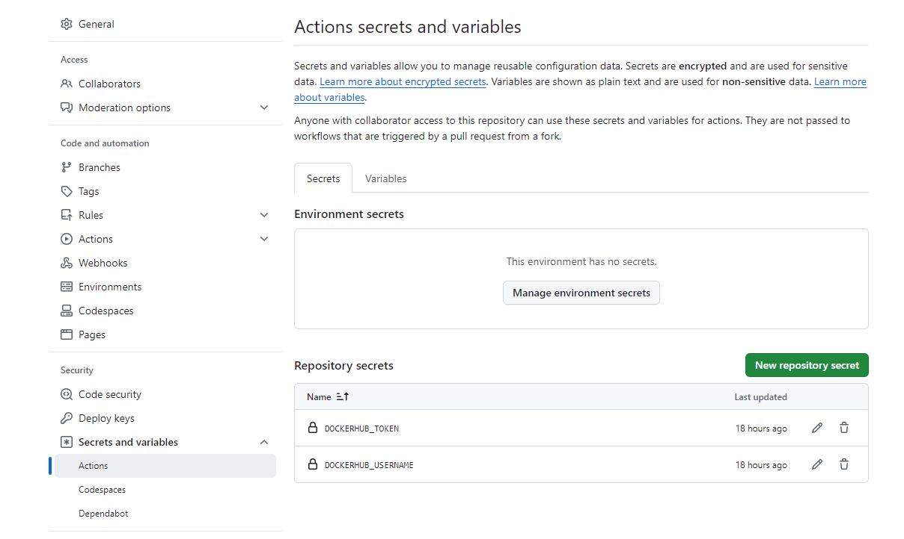

## GitHub Action for CI/CD Workflow for Spring boot Application Containerization using Reusable Workflow with Caching

**Objective:** We are going to create CI/CD workflow for Maven Based source code in which we are going to work with reusable workflows and caching. Using Caching we are going to make sure our maven dependencies get cached, so that during recurring builds maven dependencies don’t get downloaded from fresh and they can be picked up from cache. As part of the CI/CD workflow, we are going to build a custom Docker image and then upload it to the Docker hub registry.

**Tools required:** GitHub Actions, Docker Containerization

**Prerequisites:** All Process based on this Repository https://github.com/anujdevopslearn/MavenBuild.git. 


__Steps:__
* **Reusable Workflows:**
    * **Definition:** Reusable workflows are modular workflows that can be invoked by multiple GitHub Actions workflows. This promotes code reuse and simplifies maintenance.
    * **Benefit:** Reduces redundancy and simplifies the management of CI/CD pipelines.

* **Caching:**
    * **Purpose:** Caching Maven dependencies speeds up the build process by avoiding the need to download dependencies on every build.
    * **Implementation:** Using GitHub Actions Cache, Maven dependencies can be stored and retrieved in subsequent builds.

* **Docker Image:**
    * **Creation:** A custom Docker image is built, containing all necessary dependencies and configurations.
    * **Publishing:** The built Docker image is uploaded to the Docker Hub registry, making it available for use in various environments.

* **GitHub Action:**
    * **Secrets:** It is important that the variables can be used in the action, the parameter "secretes: inherit" must be set!
        

Example GitHub Action YAML File - caller.yml

```yaml
name: Reusable Workflow Caller

on: [push]

jobs:
  Reusable-caller-job:
    uses: ./.github/workflows/maven-cache.yml
    secrets: inherit

```

Example GitHub Action YAML File - caller.yml

```yaml
name: Docker image Build Process

on:
  workflow_dispatch:
  workflow_call:
    secrets:
      DOCKERHUB_USERNAME:
        required: true
      DOCKERHUB_TOKEN:
        required: true
        
jobs:
  docker:
    env:
     appName: "springboot-image"
    runs-on: ubuntu-latest

    steps:
    - name: Checkout code
      uses: actions/checkout@v2
    - name: Set up JDK 11
      uses: actions/setup-java@v3
      with:
        java-version: '11'
        distribution: 'temurin'
        cache: maven
    - name: Build with Maven
      run: mvn -B package --file pom.xml
    - name: Set up Docker Buildx
      uses: docker/setup-buildx-action@v2
      
    - name: Check Docker Hub Username
      env:
        USER_DOCKER: ${{ secrets.DOCKERHUB_USERNAME }}
      run: |
        if [ -z "$USER_DOCKER" ]; then
          echo "Docker Hub Username is not set"
          exit 1
        else
          echo "Docker Hub Username is set"
        fi
    - name: Login to Docker Hub
      uses: docker/login-action@v2
      with:
        username: ${{ secrets.DOCKERHUB_USERNAME }}
        password: ${{ secrets.DOCKERHUB_TOKEN }}
    - name: Build and push
      uses: docker/build-push-action@v4
      with:
        context: .
        push: true
        tags: ${{ secrets.DOCKERHUB_USERNAME }}/${{ env.appName }}:latest
```


### Summary
This workflow ensures that Maven dependencies are cached to reduce build times. Additionally, a custom Docker image is built and uploaded to the Docker Hub registry, facilitating deployment and scaling of the application.
